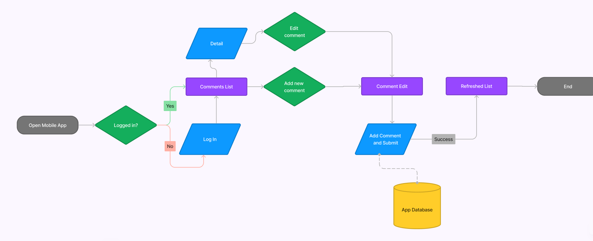

## SRS and DDS documentation

Dongguo 1895830

1.  INTRODUCTION

    1.  Motivation
        - The motivation behind developing this app is to add a community function to our previous team project, [Food Recipe Share](https://github.com/dongguowu/food_recipe_share). Food Recipe Share is a platform where users can share and discover food recipes. By introducing a community function, we aim to enhance user engagement and interaction within the app.
    1.  Summarize the problem your app would solve.
        - The app currently lacks a robust user permit management system. As the app deploy and publish, it becomes essential to have a mechanism for administrators to manage user permissions. This includes controlling and regulating user actions, such as posting comments, as well as accessing specific data or resources within the app.
        - A registered user will be allowed to create a new comment or add a reply comment for existed comment.
    1.  Summarize the solution you propose.

        - User Authentication: Implement a secure user authentication system to verify the identity of users and prevent unauthorized access.

        - Role-Based Access Control: Introduce a role-based access control mechanism that allows administrators to assign specific roles to users. Each role will have predefined permissions, dictating what actions and resources a user with that role can access.

    1.  Describe format of the rest of the documentation
        - The documentation will be written in [Markdown](https://www.markdownguide.org/basic-syntax/) format, which provides a simple and straightforward syntax for formatting text. Markdown is widely supported and can be easily converted to various formats including PDF.

1.  MOTIVATION

    1. What is the background of the problem?
       - The background of the problem stems from the need to enhance the user experience and interaction within the existing app, Food Recipe Share. The current app lacks a comprehensive user permit management system, which can lead to issues such as unauthorized actions or inappropriate content. Therefore, there is a need to address these challenges and provide a more controlled and regulated environment for user interactions.
    1. Why is this problem interesting? •
       - This problem is interesting because it directly impacts the user engagement and overall community experience within the app. By implementing a robust user permit management system, administrators can have better control over user actions, ensuring a safer and more enjoyable environment for all users. Additionally, this problem provides an opportunity to explore and implement features related to user authentication, role-based access control, and permission assignment, which are essential components in many modern applications.
    1. When and why does the problem occur?
       - The problem occurs when there is a lack of effective user permit management. It can arise when users engage in inappropriate behavior, post spam or offensive content, or attempt unauthorized actions within the app. Without proper control mechanisms, the user experience may be compromised, and administrators may struggle to manage and regulate user activities effectively.
    1. Is the problem already solved?

       - The problem of user permit management is not uncommon, and there are existing solutions available. However, the current state of the solutions may vary in terms of functionality, ease of use, and integration with other app features. While some applications may have basic permission management systems, they might lack the level of customization and granularity required for comprehensive control. Therefore, there is still room for improvement and innovation in this area.

    1. What is the current state of the solutions? Are there any similar systems or solutions to the one you propose?

       - There are existing systems and solutions that offer user permit management features. These solutions may include varying levels of functionality, such as role-based access control, permission assignment, and user authentication. Examples of similar systems include user management systems in content management platforms, community forums, or social media platforms. However, the proposed app aims to integrate these features seamlessly into the existing Food Recipe Share app, providing a tailored solution specifically designed for its community function.

    1. What improvements does your app make to current solutions?

       - Integration with Authentication: The app incorporates user authentication, ensuring that only registered and authenticated users can write comment within the app.

       - Role-Based Access Control: The app implements role-based access control, allowing administrators to assign specific roles to users. This grants predefined permissions, dictating what actions and resources each user can access.

       - Permission Assignment: The app provides administrators with the ability to assign granular permissions to individual users, enabling precise control over user actions and data access.

1.  ENVIRONMENT

    - hardware: Windows11 Machine(Intel CORE i7, RAM 32GB)
    - software: Android Studio Flamingo

1.  REQUIREMENTS

    1.  How does your app cover all requirements

        > ### Fragments
        >
        > - Comments List: Displays a list of comments.
        > - Comment Detail (Edit): Allows users to view and edit a specific comment.
        > - User Login/Register: Provides a login and registration functionality for users.
        > - User Management as Admin/Grant User Group/Permit: Enables administrators to manage users, assign user groups, and set permissions.
        > - User Location: Integrates the [Google Maps SDK for Android](https://developers.google.com/codelabs/maps-platform/maps-platform-101-android#0) for Android to display user locations.comments list
        >
        > ### Lists presentation
        >
        > - Comment List: Presents a list of comments.
        > - User List: Displays a list of users.
        >
        > ### SQLite Database / Firebase Database
        >
        > - Comment: Stores comment data.
        > - User: Manages user information.
        > - UserGroup: Stores user group data.
        >
        > ### Email notification
        >
        > - User Register: Sends email notifications when a user registers.
        > - user Permission updated: Sends email notifications when a user permission upgraded.
        >
        > ### Interaction with user
        >
        > - User Login/Register: Allows users to log in or register.
        > - Comment Edit: Enables users to edit their comments.
        > - User Group Edit: Allows administrator to edit user group.
        >
        > ### features
        >
        > - [Jetpack Compose](https://developer.android.com/jetpack/compose/documentation) / [Material3](https://developer.android.com/jetpack/compose/designsystems/material3)
        > - Calendar / [Date pickers](https://m3.material.io/components/date-pickers/overview)
        > - [Google Maps SDK for Android](https://developers.google.com/codelabs/maps-platform/maps-platform-101-android#0)
        > - ~~QR or bar code~~
        > - Login / [Firebase Authentication](https://firebase.google.com/docs/auth/android/firebaseui)
        > - CRUD methods (comment / user)
        > - ~~Feature time, temperature, weather~~
        > - Custom views / Stateless Components (comment card / user card)
        > - API IO (camera capture)
        > - AI android library (text recognition, barcode scanning) How does your app cover all requirements as mentioned above.

    2.  If one or more requirements are not met, describe how, and provide an explanation.
        > - Six non-trivial functional screens may be too extensive for the project's scope. The focus is on details and practicing useful and interesting functionalities.
        > - Plans to use Jetpack Compose and Material3, which have different concepts compared to traditional fragments, RecyclerView, and data adapter. However, the equivalent concepts, such as screens, lazy columns, and stateless components, will be used to achieve the desired functionality.
    3.  Briefly describe the SDLC model that is used for this development and why the choice of that model.
        > Agile. Agile is selected because it is well-suited for projects with short timelines, enabling frequent testing and feedback. It allows for quick identification and resolution of any issues that may arise during the development process, promoting flexibility and adaptability to changing requirements.

1.  DESIGN

    1.  Provide a use case diagram based on actors and use cases of your app as covered in class.

    

    2.  Describe the navigation of your app. Include a figure to illustrate the navigation “graph”.

    

    3.  What is the first fragment they will see?

        > The first fragment that users will see is the **Home Page**. It displays related comments, and when users click the profile icon, they will be redirected to the Login screen.

    4.  From each fragment to which other fragment will they be able to go? Describe the event that triggers the navigation.
        > - login -> home when success
        > - login -> sign up when click signup button
        > - home -> detail when click button
        > - home -> user admin when click bottom button
        > - home -> login when click profile icon
        > - detail -> edit when click edit icon
        > - detail -> home when click back icon
        > - detail -> user location when click user icon
        > - edit -> detail when click submit button

1.  CODING AND TESTING •
    1.  The .apk file must be extracted at the end of the development.
        - .apk file save on '\app\build\outputs\apk\debug' when Build / Build Bundle / APK on Android Studio
    2.  The testing must include running the .apk file onto an android phone and capture some screenshots.
        - will run on Samsung Android Phone(Android 11)
