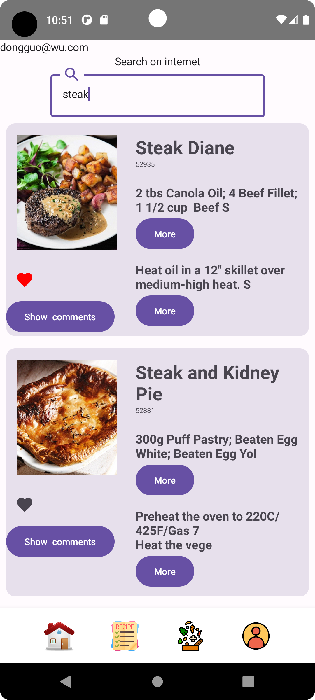
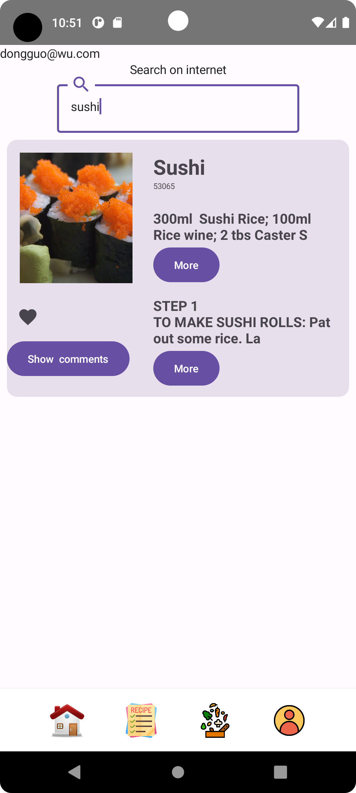
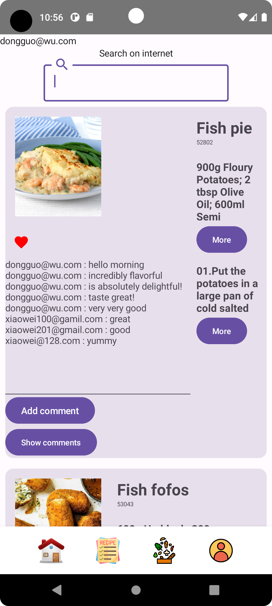
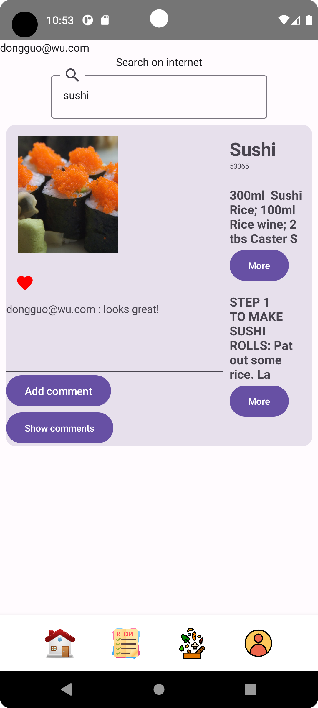
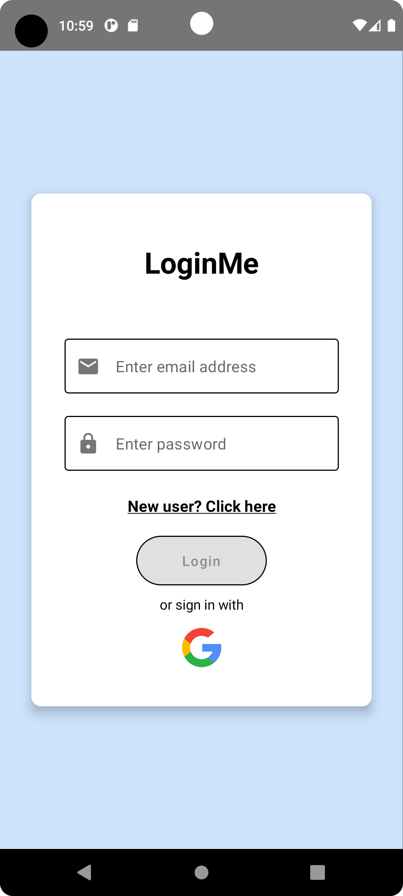
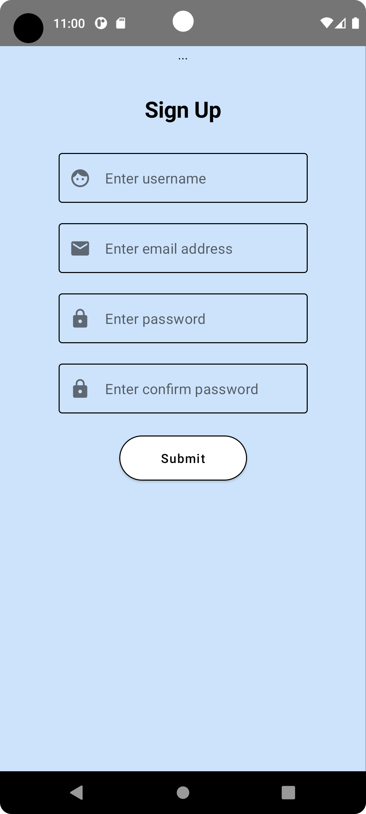
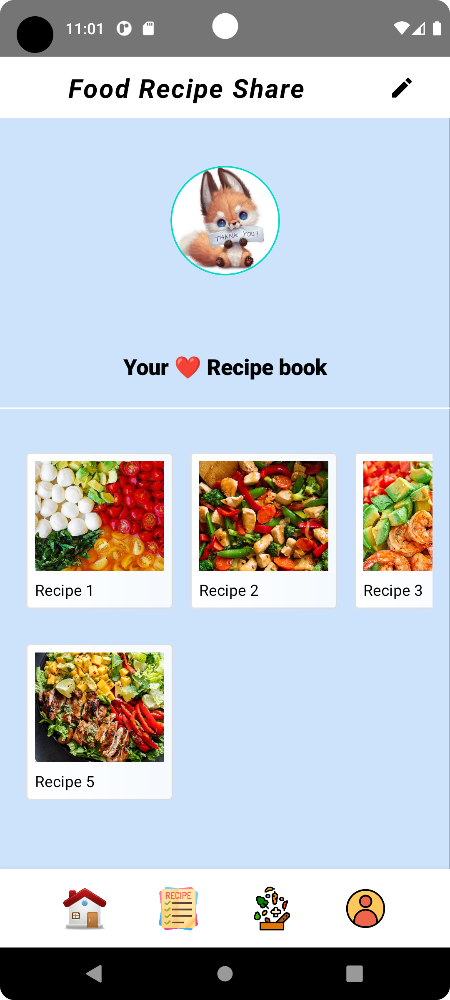
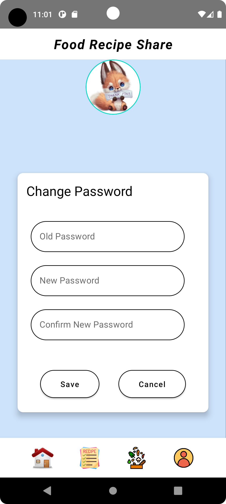
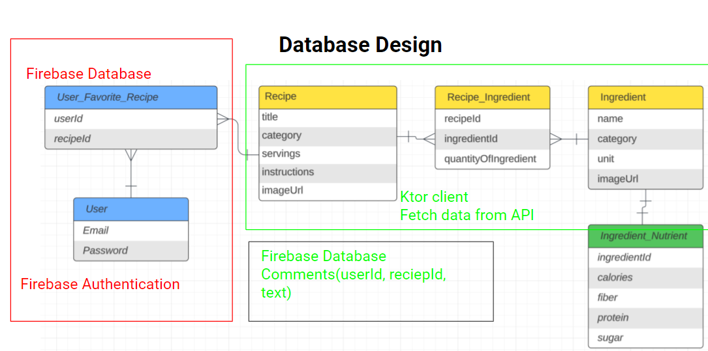
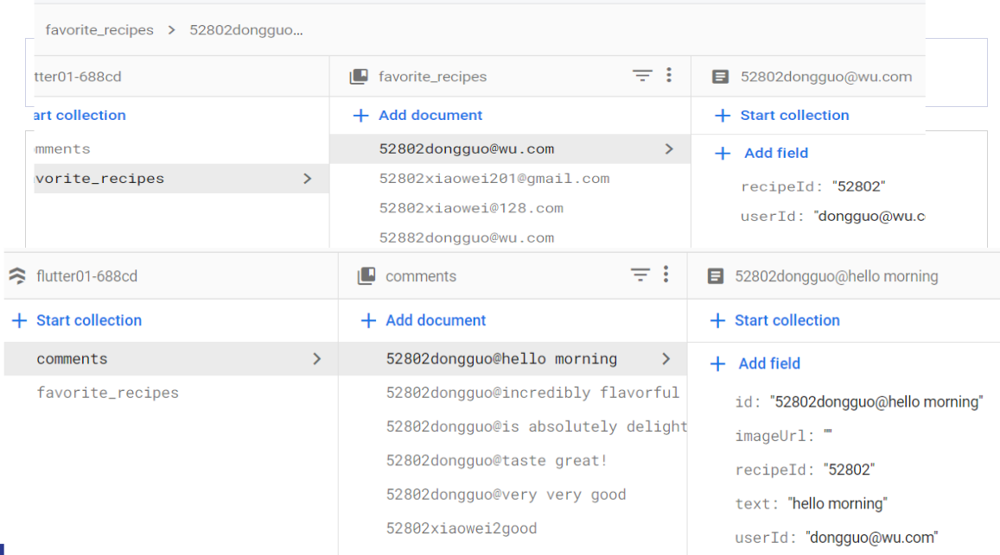

# Project : Food Recipe Share Kotlin Multiplatform / Compose Multiplatform App

### [Dongguo Wu](https://github.com/dongguowu)

### [Garret](https://github.com/Aeternitas460/food_recipe_share_garett)

### [Xiaowei](https://github.com/xiaoqianniu/food_recipe_share)

### Based on [AppKickstarter Template](https://github.com/JetBrains/compose-multiplatform-ios-android-template)

## Functionality

### Recipe Search from large real food recipe data

 

### Recipe user review ( favorite, comments)

 

### User Registration and Authentication

 

### User Profile

  Implement CRUD

## Database Design and Implementation

- User Auth: create new, login, update password
- Recipe: search by title
- User-favorite-Recipe: create, delete
- Recipe-comments: create, getAllByRecipeID
- Ingredient and Nutrient are not implemented

## Technology

- [Kotlin Multiplatform](https://kotlinlang.org/docs/multiplatform.html)
- Firebase Authentication
- Firebase Database
- [Ktor client](https://ktor.io/docs/create-client.html)
- [Voyager](https://github.com/adrielcafe/voyager) navigation
- JetPack Compose / Material3 Components
- Material3 Theme
- Git GitHub
- [Napier](https://github.com/AAkira/Napier) Logger
- [Kotlin Multiplatform Libraries](https://github.com/AAkira/Kotlin-Multiplatform-Libraries)

## Next

- Registered user creates and shares her own recipe
- Add pictures by phone camera in the comments
- Food recipe nutrition calculated by ingredients
- Food recipe rating computing by user favorite recipes data, and user positive / negative comments
- Search or Generate recipe picture (call AI api)
